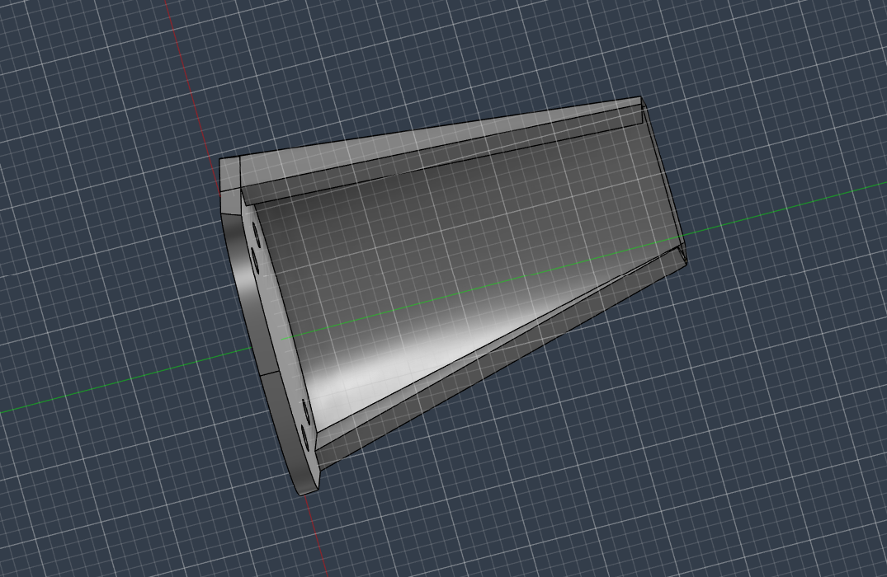
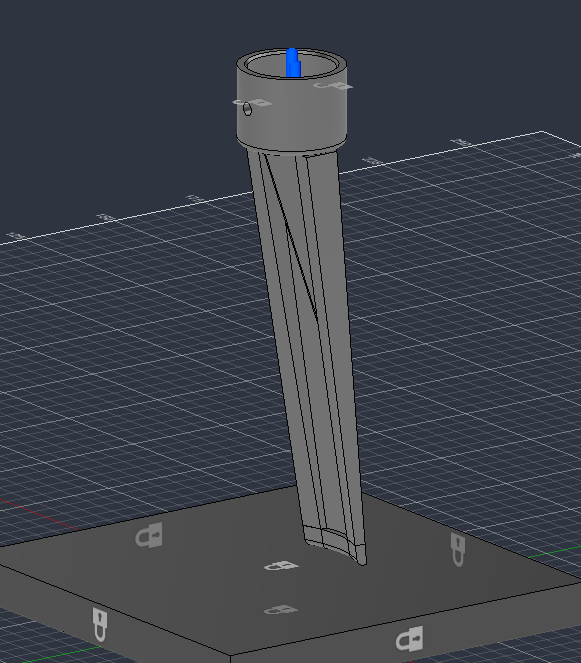
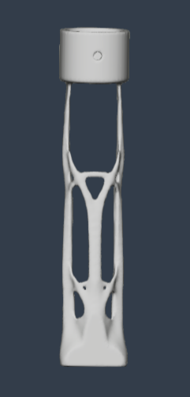
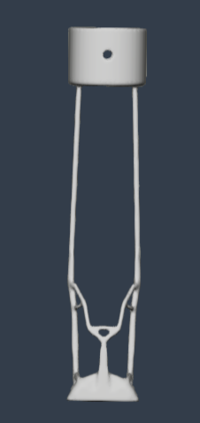
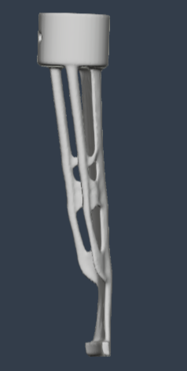
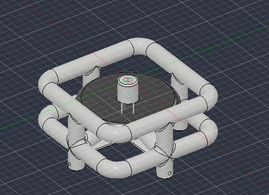

# 3D Models

This directory contains the CAD models developed and evaluated throughout the reverse engineering, optimization, and testing phases of this project.

The models illustrate the progression from the reconstructed baseline geometry to multiple optimization concepts and the final design selected for manufacturing and testing.

---


## Original UAV Landing Leg
<p align="left">
  
</p>

```
Original_UAV_Landing_Leg.f3d
```

This model represents the reconstructed baseline geometry derived from the reverse-engineered landing leg.

Compared to the scanned component, this version includes slight geometric refinements that improved manufacturability and structural consistency while preserving the overall function and appearance of the original design.

This model served as the engineering reference for all subsequent simulations and optimization studies.

**Purpose**

- Baseline CAD model
- Reference geometry
- Simulation comparison
- Starting point for optimization

---


## Reinforced Reference Model
<p align="left">
  
</p>

```
Reinforced_Reference_Model.f3d
```

This model is an elongated and structurally reinforced version of the reconstructed landing leg.

Additional material was introduced to improve stiffness and create a stronger baseline before applying computational optimization techniques.

Although this was not the final manufactured design, it provided an important comparison against later lightweight concepts.

**Purpose**

- Strengthened reference design
- Initial simulation model
- Baseline for optimization studies

---

### Spring-Inspired Landing Leg

```
Spring_Inspired_Leg.f3d
```

<p align="center">
  
</p>

This concept was developed as a hand-designed exploration of an alternative approach to UAV landing gear. Rather than optimizing an existing geometry, the design reimagines the landing leg as a compliant structure capable of behaving similarly to a spring.

The inspiration came from both biological systems and compliant mechanical structures, particularly the way insect legs deform during landing to absorb and redistribute impact energy. The continuous curved geometry was intended to encourage controlled elastic deformation, allowing the leg to flex under load before returning toward its original shape.

Unlike the topology and generative design models included in this repository, this concept was created manually as an engineering thought experiment. It was used to investigate how geometry alone could contribute to energy absorption and impact mitigation without relying solely on additional material or increased stiffness.

**Design Inspiration**

- Biological locomotion
- Insect leg mechanics
- Compliant mechanisms
- Spring-like energy absorption
- Biomimetic engineering


## Generative_Design

Several computationally generated concepts were explored during the optimization phase.

These models were produced using Fusion 360 Generative Design under identical loading conditions but represent different stages of the design exploration process.

---

### Iteration 01 — Dual-Strut Concept
<p align="left">
  
</p>

```
Iteration_01_Dual_Strut.f3d
```

This early generative design concept features two primary structural members connecting the landing foot to the upper mounting interface.

The design demonstrated significant weight reduction while maintaining the required load path.

Although structurally interesting, it was retained only as an intermediate design study.

---

### Iteration 02 — Lightweight Dual-Strut Concept
<p align="left">
  
</p>

```
Iteration_02_Lightweight_Dual_Strut.f3d
```

This model is a more aggressively optimized derivative of the previous dual-strut concept.

Material removal produced an even lighter structure with thinner supporting members.

While this iteration demonstrated the capabilities of generative design, it was ultimately considered too lightweight for prototype manufacturing and served primarily as a comparison during design evaluation.


---

## Final Design
<p align="left">
  
</p>

```
Final_Hybrid_Design.f3d
```

This model represents the final optimized geometry selected for manufacturing and testing.

The design was generated using:

- Fixed constraint applied at the upper mounting interface
- Load applied from the landing foot upward toward the mounting interface

This configuration reflects the primary structural loading path used during the optimization study.

This model was selected as the final engineering solution and served as the basis for additive manufacturing and experimental qualification.

---


## Drop Test Rig
<p align="left">
  
</p>

```
Drop_Test_Rig.f3d
```

The drop test rig was designed to provide a repeatable experimental platform for evaluating the performance of the UAV landing legs under controlled impact conditions.

The rig securely mounted the landing leg assemblies while maintaining consistent alignment throughout testing.

This fixture enabled controlled drop testing using multiple landing surfaces and supported integration with embedded instrumentation, including the ESP32 microcontroller, ADXL375 accelerometer, and VL53L1X time-of-flight sensor.

The rig ensured that differences observed during testing resulted from the landing leg designs rather than inconsistencies in the experimental setup.

**Purpose**

- Mount landing legs
- Repeatable testing
- Sensor integration
- Controlled impact evaluation
- Experimental validation

---

# Notes

Only the **Final Hybrid Design** was selected for metal fabrication and experimental qualification.

The remaining generative design models are included to document the engineering design process and illustrate the progression of computational optimization throughout the project.
