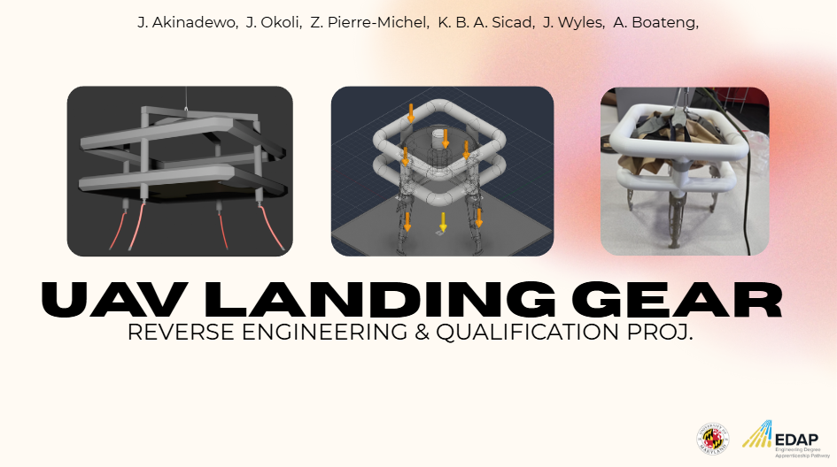

<p align="center">
  <a>
    
  </a>
</p>

> University of Maryland – Department of Materials Science & Engineering
> 
> Summer 2026 - Engineering Design & Additive Manufacturing Research Internship Through *Growth Sector's EDAP Program*

---

## Overview

This repository documents an eight-week engineering research internship completed with the University of Maryland Department of Materials Science & Engineering.

The project followed the complete engineering design process to reverse engineer, digitally reconstruct, optimize, manufacture, and qualify an existing unmanned aerial vehicle (UAV) landing leg. The original component lacked engineering documentation, requiring the team to recover its geometry through metrology, evaluate its structural performance through computational modeling, redesign the component for improved performance and manufacturability, fabricate prototypes using multiple additive manufacturing processes, and validate the final designs through experimental testing.

Rather than focusing on a single engineering discipline, the project integrated reverse engineering, CAD reconstruction, finite element analysis, topology optimization, additive manufacturing, embedded systems, experimental testing, and engineering documentation into one continuous workflow.

---

## Project Background

Mechanical components frequently require replacement long after the original design documentation has been lost or becomes unavailable. In many cases, replacement parts must not only replicate the original geometry but also improve manufacturability, structural performance, and overall efficiency.

To simulate this engineering challenge, the internship used the landing foot from a 2 kg UAV as a case study. The project provided an opportunity to apply the engineering design process from initial inspection through final qualification while maintaining the intended functionality of the original component.

---

## Case Study

The selected engineering challenge involved the qualification of a UAV landing foot intended for a 2kg quadcopter.

The landing gear was expected to:
- Support takeoff and landing
- Perform across multiple landing surfaces including concrete, *(exp: soil, grass, pavement)*
- Protect onboard electronics during impact
- Maintain structural integrity
- Remain economical to manufacture

---

## Engineering Workflow

The complete workflow followed throughout the internship is shown below.

```text
Existing Part
      │
      ▼
Reverse Engineering
      │
      ▼
3D Scanning & Metrology
      │
      ▼
CAD Reconstruction
      │
      ▼
Design Evaluation
      │
      ▼
Topology Optimization
      │
      ▼
Hybrid Design Development
      │
      ▼
Computational Modeling
      │
      ▼
Additive Manufacturing
      │
      ▼
Instrumentation
      │
      ▼
Experimental Testing
      │
      ▼
Qualification
```

Each stage informed the next, allowing engineering decisions to be supported by measured data instead of assumptions.

---


## Reverse Engineering

The project began with reverse engineering an existing UAV landing foot.

Using the Hexagon Romer Absolute Arm, the physical component was digitized into a high-resolution mesh. The resulting scan data was processed in Geomagic Design X to remove imperfections, extract geometric features, and reconstruct an editable CAD model suitable for engineering analysis and manufacturing.

### Primary Tools

- Hexagon Romer Absolute Arm
- Geomagic Design X
- Autodesk Fusion 360

---

## Design and Optimization

Following reconstruction, the landing foot underwent multiple design iterations focused on improving structural performance while minimizing unnecessary material.

Optimization techniques included:

- Static stress analysis
- Shape optimization
- Generative design
- Hybrid optimization

Rather than selecting a purely topology-optimized solution, the final design combined the structural efficiency of topology optimization with the manufacturable geometry of the selected generative design. :contentReference[oaicite:6]{index=6}

---

## Computational Modeling

Finite element analysis was used to evaluate both the original and optimized landing leg designs.

The project progressed from static structural analysis toward dynamic event modeling to better represent transient impact events encountered during landing.

Simulation development included:

- Static stress analysis
- Dynamic event modeling
- Custom nonlinear material definition
- Stress-strain curve development for LPBF 316L stainless steel
- Impact simulations at multiple drop heights

Simulation parameters included:

- Material: 316L Stainless Steel
- Drop heights: 0.15 m, 0.30 m, 0.50 m
- Rigid impact surface
- Gravity enabled
- Structural constraints
- Separated contact conditions

---

## Additive Manufacturing

Multiple additive manufacturing technologies were explored throughout the project.

### PETG Prototype

- Material: PETG
- Process: FDM
- Printer: Bambu Lab X1 Carbon
- Layer Height: 0.16 mm
- Gyroid infill

### Nylon Prototype

- Material: Nylon 12
- Process: Selective Laser Sintering (SLS)

### Metal Prototype

- Material: Stainless Steel
- Process: Laser Powder Bed Fusion (LPBF)

These manufacturing methods allowed comparison between polymer prototypes and production-capable metal components.

---

## Embedded Instrumentation

A custom embedded data acquisition system was developed to characterize landing performance during experimental testing.

Primary components included:

- ESP32 Microcontroller
- ADXL375 High-G Accelerometer
- VL53L1X Time-of-Flight Distance Sensor

The instrumentation system measured:

- Free-fall duration
- Landing velocity
- Peak acceleration
- Bounce height
- Distance from ground
- Structural response during impact

Sensor communication utilized the I²C protocol and calibration routines were implemented prior to testing to reduce measurement error.

## Experimental Testing

Prototype qualification consisted of controlled drop testing.

Testing incorporated:

- Custom drop rig
- Camera tracking
- Embedded sensors
- Multiple landing surfaces
- Graphical data analysis
- Visual inspection

Drop tests were conducted on:
- Concrete
- Soil

using multiple drop heights to evaluate structural behavior under different impact conditions.

## Key Results

Highlights from the project include:

- Successful digital reconstruction of the original UAV landing foot
- Development of a manufacturable hybrid optimized design
- Integration of computational modeling and physical testing
- Custom nonlinear material modeling for 316L stainless steel simulations
- Embedded instrumentation for experimental qualification
- Peak acceleration reduction of approximately **62%** at a 0.5 m drop height
- Maximum yielding reported at approximately **10.1%** during evaluation

---

## Skills Demonstrated

This project demonstrates experience in:

- Engineering Design Process
- Reverse Engineering
- Metrology
- CAD Reconstruction
- Fusion 360
- Geomagic Design X
- Finite Element Analysis
- Dynamic Event Simulation
- Topology Optimization
- Generative Design
- Design for Additive Manufacturing
- Experimental Design
- Data Acquisition
- Sensor Calibration
- ESP32 Embedded Systems
- Engineering Documentation
- Technical Communication

---

## Repository Structure

```text
assets/
data/
docs/
firmware/
models/
references/
presentation/
```

Additional documentation for each engineering phase can be found within the corresponding directories.

---

## Personal Contributions

During this internship, I contributed to multiple phases of the engineering workflow, including CAD reconstruction, computational modeling, design optimization, embedded instrumentation, firmware development, sensor calibration, experimental testing, data analysis, and technical documentation.

This repository serves as a technical record of that work and highlights the interdisciplinary engineering skills developed throughout the internship.

---


## Repository purpose

This repository is intended for educational and professional portfolio purposes.

Some proprietary design files, datasets, or laboratory resources may not be included.

---

## Acknowledgements

This work was completed through the Engineering Design and Additive Manufacturing Program (EDAP) hosted at the University of Maryland Department of Materials Science & Engineering in collaboration with Growth Sector.

Special thanks to the faculty, researchers, graduate students, and fellow interns whose mentorship and collaboration contributed to the success of this project.

---
